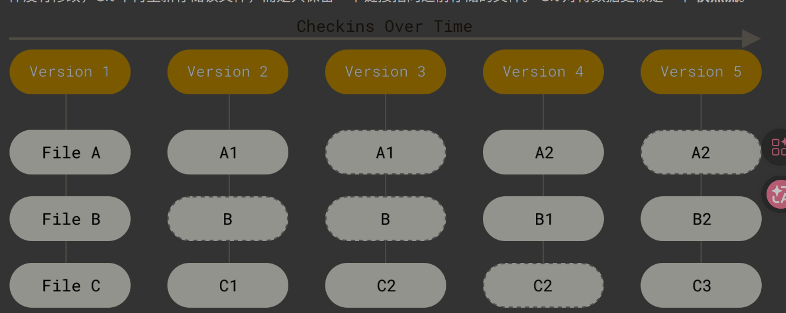

# 1.起步

## 1.1 关于版本控制

版本控制系统(VCS)：可以将选定的文件回溯到之前的状态，甚至将整个项目都回退到过去某个时间点的状态，你可以比较文件的变化细节，查出最后是谁修改了哪个地方，从而找出导致怪异问题出现的原因，又是谁在何时报告了某个功能缺陷等等。 使用版本控制系统通常还意味着，就算你乱来一气把整个项目中的文件改的改删的删，你也照样可以轻松恢复到原先的样子。 但额外增加的工作量却微乎其微。

本地版本控制系统：其中最流行的一种叫做 RCS，工作原理是在硬盘上保存补丁集（补丁是指文件修订前后的变化）；通过应用所有的补丁，可以重新计算出各个版本的文件内容。

集中化的版本控制系统(CVCS): 这类系统，诸如 CVS、Subversion 以及 Perforce 等，都有一个单一的集中管理的服务器，保存所有文件的修订版本，而协同工作的人们都通过客户端连到这台服务器，取出最新的文件或者提交更新。 多年以来，这已成为版本控制系统的标准做法。

集中化的版本控制： 本地版本控制系统也存在类似问题，只要整个项目的历史记录被保存在单一位置，就有丢失所有历史更新记录的风险。

分布式版本控制系统(DVCS):客户端并不只提取最新版本的文件快照， 而是把代码仓库完整地镜像下来，包括完整的历史记录。 这么一来，任何一处协同工作用的服务器发生故障，事后都可以用任何一个镜像出来的本地仓库恢复。 因为每一次的克隆操作，实际上都是一次对代码仓库的完整备份。

## 1.2 Git简史

·········

## 1.3 Git是什么？

**直接记录快照，而非差异比较：**

其他大部分系统以文件变更列表的方式存储信息，这类系统将它们存储的信息看作是一组基本文件和每个文件随时间逐步累积的差异；

在Git中，每当你提交更新或保存项目状态时，它基本上就会对当时的全部文件创建一个快照并保存这个快照的索引。(如果文件没有修改，Git不再重新存储该文件，而是只保留一个链接指向之前存储的文件) Git对待数据更像是一个`快照流`。

存储项目随时间改变的快照：这是Git与几乎所有其他版本控制系统的重要区别。

近乎所有操作都是本地执行：
举个例子：如果你想查看当前版本与一个月前的版本之间引入的修改，Git会查找到一个月前的文件做一次本地的差异计算，而不是由远程服务器处理或从远程服务器拉回旧版本文件再来本地处理。

Git保证完整性：

Git 中所有的数据在存储前都计算校验和，然后以校验和来引用。 这意味着不可能在 Git 不知情时更改任何文件内容或目录内容。 这个功能建构在 Git 底层，是构成 Git 哲学不可或缺的部分。 若你在传送过程中丢失信息或损坏文件，Git 就能发现。

`Git数据库中保存的信息都是以文件内容的哈希值来所引，而不是文件名。`

