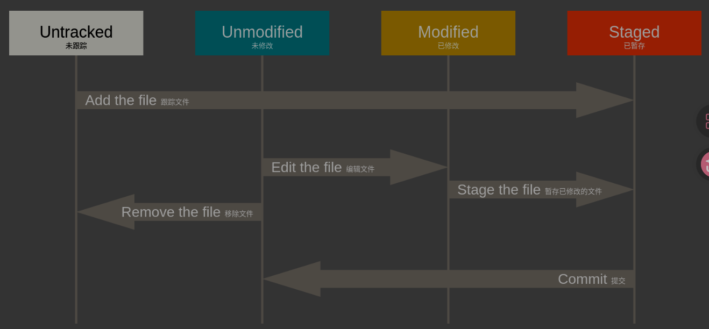

# 2.Git基础

## 2.1获取Git仓库

目的：能够配置并初始化一个仓库（repository）、开始或停止跟踪（track）文件、暂存（stage）或提交（commit）更改。

    git init

    git clone https://github.com/libgit2/libgit2

## 2.2记录每次更新到仓库

检查当前文件状态：
git status

查看已暂存和未暂存的修改：
git diff

提交更新：
git commit

移除文件：
git rm

移动文件：
git mv file_from file_to

## 2.3查看提交历史

查看提交历史：
git log

## 2.4撤销操作

有时候我们提交完了才发现漏掉了几个文件没有添加，或者提交信息写错了，可以运行撤销命令来重新提交

撤销操作：
git commit --amend

当你提交后发现忘记了暂存某些需要的修改，可以像下面操作：
git commit -m "initial commit"
git add forgotten_file
git commit --amend

取消暂存的文件：
git reset HEAD <file>...

撤销对文件的修改：
git checkout -- <file>...

记住，在git中任何`已提交`的东西几乎总是可以恢复的。甚至那些被删除的分支中的提交或使用`--amend`选项覆盖的提交也可以恢复。

## 2.5远程仓库的使用

查看远程仓库：
git remote

添加远程仓库:
git clone ...

从远程仓库中抓取与拉取：
git fetch <remote>

推送到远程仓库：
git push origin main

查看某个远程仓库：
git remote show origin

